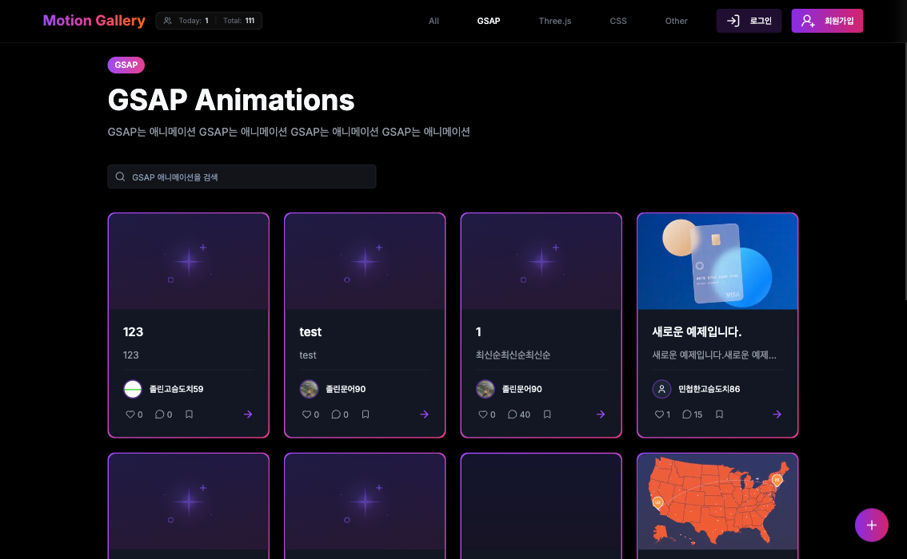

# 모션 레퍼런스 공유 플랫폼(MotionGallery)



## 📋 프로젝트 소개

MotionGallery는 GSAP, Three.js, CSS 기반의 모션 인터랙션과 애니메이션 예제를 탐색하고 공유할 수 있도록 만든 웹 플랫폼입니다.

카테고리별 예제 탐색부터 상세 확인, 마크다운 기반 작성, 댓글 소통까지 한 흐름으로 이어지도록 구성해, 모션 레퍼런스를 모으고 기록하는 경험에 집중했습니다.

## 🌐 배포 링크 / 데모

- Demo: [https://motiongallery.vercel.app/](https://motiongallery.vercel.app/)

## ✨ 주요 기능

### 예제 탐색

- 홈 화면에서 최신 예제를 카테고리 단위로 구분해 노출
- GSAP, Three.js, CSS, Other 카테고리별 예제 탐색 지원
- 카테고리 페이지에서 검색어 기반 예제 필터링 제공
- 무한 스크롤 기반 목록 로딩으로 연속적인 탐색 경험 제공

### 예제 상세

- 예제 제목, 설명, 태그, 작성자 정보를 한 화면에서 확인 가능
- 마크다운 렌더링 기반으로 본문 콘텐츠 제공
- 좋아요 및 북마크 상태를 사용자 기준으로 연동
- 댓글, 답글, 삭제/수정 흐름을 포함한 커뮤니티 기능 지원

### 예제 작성 및 수정

- 새 예제 등록 및 기존 예제 수정 지원
- 제목, 카테고리, 설명, 썸네일, 본문을 폼 기반으로 입력
- 마크다운 에디터를 활용한 예제 문서 작성 지원
- 태그를 직접 입력하거나 AI 추천 기능으로 자동 생성 가능

### 인증 및 사용자 상태

- 이메일/비밀번호 로그인 및 회원가입 지원
- Google, GitHub, Kakao 소셜 로그인 지원
- 이메일 인증 코드 발송 및 검증 흐름 제공
- 랜덤 닉네임 생성 및 회원탈퇴 API 연동 지원

### 사용자 경험

- GSAP 및 Motion 기반의 진입 애니메이션 적용
- 방문자 집계 및 오늘/전체 방문 수 표시
- 로딩 상태, 빈 상태, 토스트 피드백을 공통 UI로 처리

## 🛠 기술 스택

### Frontend

- **Framework**: Next.js (App Router)
- **Library**: React
- **Language**: TypeScript
- **Styling**: Tailwind CSS
- **UI Components**: Radix UI
- **Form**: React Hook Form + Zod
- **Animation**: GSAP, Motion
- **Markdown**: `@uiw/react-md-editor`, `@uiw/react-markdown-preview`

### Backend / Infra

- **Database / Auth**: Supabase
- **Email**: Resend
- **AI Tag Suggestion**: Google Generative AI (Gemini)

### Development Tools

- **Package Manager**: npm
- **Linting**: ESLint
- **Formatting**: Prettier
- **Type Checking**: TypeScript

## 🚀 빠른 시작

### 설치

```bash
npm install
```

### 환경 변수 설정

프로젝트 루트에 `.env.local` 파일을 생성하고 아래 값을 설정합니다.

```bash
NEXT_PUBLIC_SUPABASE_URL=YOUR_SUPABASE_URL
NEXT_PUBLIC_SUPABASE_ANON_KEY=YOUR_SUPABASE_ANON_KEY
SUPABASE_SERVICE_ROLE_KEY=YOUR_SUPABASE_SERVICE_ROLE_KEY
RESEND_API_KEY=YOUR_RESEND_API_KEY
GOOGLE_API_KEY=YOUR_GOOGLE_AI_API_KEY
```

### 개발 서버 실행

```bash
npm run dev
```

브라우저에서 [http://localhost:3000](http://localhost:3000) 으로 접속합니다.

### 프로덕션 빌드

```bash
npm run build
npm run start
```

## 📁 프로젝트 구조

```text
src
├── app                     # App Router 페이지 및 API 라우트
│   ├── (main)              # 메인 레이아웃 기반 화면
│   ├── (simple)            # 로그인, 회원가입, 작성 화면
│   └── api                 # 이메일 인증, 태그 추천, 방문자, 회원탈퇴 API
├── components              # 공통 UI, 레이아웃, 에디터, 애니메이션 컴포넌트
├── features
│   ├── auth                # 로그인, 회원가입, 소셜 로그인
│   ├── category            # 카테고리 목록 및 검색
│   ├── comment             # 댓글 및 답글 기능
│   ├── example             # 예제 목록, 상세, 작성/수정
│   └── home                # 홈 화면 섹션
├── hooks                   # 무한 스크롤, 태그, 인증, 폼 관련 커스텀 훅
├── lib                     # Supabase 클라이언트, 유틸, GSAP 설정
├── providers               # 인증, 테마 등 전역 Provider
└── styles                  # 글로벌 스타일
```

## ⚙️ 실행 스크립트

```bash
npm run dev
npm run build
npm run start
npm run lint
```
